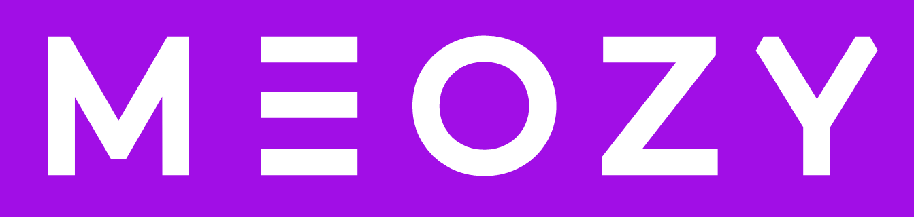

<!-- PROJECT LOGO -->

  <h3 align="center">Meozy Player</h3>
  

    Uma aplicação de streaming de áudio!
     
    <a href="">View Demo</a>
  

<!-- TABLE OF CONTENTS -->

  
Table of Contents

  <ol>
    <li><a href="#contribuidores">Contribuidores</a></li>
    <li>
      <a href="#sobre-o-porojeto">Sobre O Projeto</a>
      <ul>
        <li><a href="#construido-com">Construido Com</a></li>
      </ul>
    </li>
    <li><a href="#licença">Licença</a></li>
  </ol>

<!-- CONTRIBUITORS -->
## Contribuidores

Obrigado vai para essas pessoas maravilhosas!

<!-- ALL-CONTRIBUTORS-LIST:START - Do not remove or modify this section -->
<!-- prettier-ignore-start -->
<!-- markdownlint-disable -->
<table>
  <tbody>
    <tr>
      <td align="center" valign="top" width="14.28%"><a href="https://github.com/caio-couto.com"> <b>Caio Couto</b></a> <a href="https://github.com/codesandbox/codesandbox-client/commits?author=CompuIves" title="Code">💻</a><a href="#design-CompuIves" title="Design">🎨</a><a href="https://github.com/codesandbox/codesandbox-client/commits?author=CompuIves" title="Documentation">📖</a><a href="#infra-CompuIves" title="Infrastructure (Hosting, Build-Tools, etc)">🚇</a><a href="https://github.com/codesandbox/codesandbox-client/commits?author=CompuIves" title="Tests">⚠️</a></td>
      <td align="center" valign="top" width="14.28%"><a href="https://github.com/poenix888.com"> <b>Poenix</b></a> <a href="https://github.com/codesandbox/codesandbox-client/commits?author=donavon" title="Code">💻</a><a href="https://github.com/codesandbox/codesandbox-client/commits?author=CompuIves" title="Tests">⚠️</a></td>
      <td align="center" valign="top" width="14.28%"><a href="http://www.jeffallen.io/"> <b>Roberto Couto</b></a> <a href="https://github.com/codesandbox/codesandbox-client/commits?author=vueu" title="Code">💻</a><a href="#design-CompuIves" title="Design">🎨</a><a href="https://github.com/codesandbox/codesandbox-client/commits?author=CompuIves" title="Tests">⚠️</a></td>
    </tr>
  </tbody>
</table>

<!-- markdownlint-restore -->
<!-- prettier-ignore-end -->

<!-- ALL-CONTRIBUTORS-LIST:END -->

<!-- ABOUT THE PROJECT -->
## Sobre O Porojeto

O Meozy é um aplicativo de streaming de áudio e player de música que permite aos usuários ouvir suas músicas favoritas em qualquer lugar. O aplicativo oferece uma ampla seleção de músicas de artistas de todo o mundo, incluindo artistas populares, indies e desconhecidos.

O Meozy oferece uma variedade de recursos para tornar a experiência de streaming de música mais agradável. O aplicativo inclui uma interface de usuário (IU) intuitiva, uma biblioteca de mídia abrangente e recursos de personalização.

Destaques:

* Download de músicas para ouvir offline
* Acesso a músicas sem anúncios
* Qualidade de áudio superior

### Construido Com

As principais ferramentas de contrução do projeto

* 
* 
* 
* 

<!-- LICENSE -->
## Licença

Distributed under the MIT License. See `LICENSE.txt` for more information.

(<a href="#readme-top">back to top</a>)
